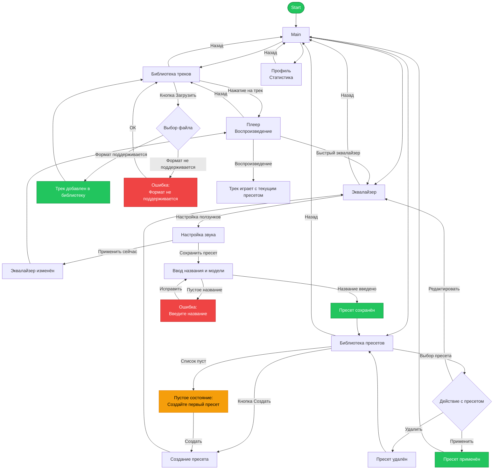

# Пользовательские сценарии и User Flow

## Пользовательские сценарии

| Сценарий | Кто | Цель | Шаги | Результат |
| --- | --- | --- | --- | --- |
| Создание пресета | Аудиофил | Настроить звук под свои наушники | 1. Открывает эквалайзер
2. Настраивает ползунки
3. Вводит модель наушников
4. Нажимает «Сохранить» | Пресет сохранён в списке |
| Применение пресета | Геймер | Быстро применить настройки | 1. Открывает библиотеку пресетов
2. Выбирает пресет
3. Нажимает «Применить» | Эквалайзер меняет настройки |
| Прослушивание с пресетом | Меломан | Проверить звук с настройками | 1. Открывает библиотеку треков
2. Выбирает трек
3. Слушает | Трек играет с текущим пресетом |
| Загрузка трека | Любой | Добавить музыку в приложение | 1. Нажимает «Загрузить»
2. Выбирает файл
3. Подтверждает | Трек появляется в библиотеке |
| Ошибка загрузки | Любой | Понять что пошло не так | 1. Нажимает «Загрузить»
2. Выбирает неподходящий файл
3. Видит сообщение об ошибке | Пользователь знает какой формат нужен |

| Элемент | Что означает |
| --- | --- |
| Прямоугольник | Экран или действие пользователя |
| Ромб | Развилка / условие |
| Стрелка | Направление перехода |
| Закруглённый прямоугольник | Начало или конец сценария |
| Красный блок | Ошибка / проблемная ситуация |
| Зелёный блок | Успешный результат |

## Таблица экранов, переходов и условий

| Экран | Назначение | Откуда | Куда | Условие |
| --- | --- | --- | --- | --- |
| Главный | Навигация по разделам | Запуск приложения | Треки, Пресеты, Эквалайзер, Профиль | Нажатие на иконку в хотбаре |
| Библиотека треков | Список загруженной музыки | Главный → Треки | Плеер | Нажатие на трек |
| Библиотека пресетов | Список сохранённых пресетов | Главный → Пресеты | Эквалайзер (редактирование) | Нажатие «Редактировать» |
| Плеер | Воспроизведение | Библиотека треков | Главный, Эквалайзер | Нажатие «Назад» / «Быстрый эквалайзер» |
| Эквалайзер | Настройка звука | Главный, Плеер, Библиотека пресетов | Главный, Список пресетов | Нажатие «Сохранить» / «Назад» |
| Профиль | Статистика | Главный → Профиль | Главный | Нажатие «Назад» |

## Итоговый вывод по User Flow

Пользовательские сценарии и User Flow показывают, как человек будет перемещаться внутри приложения от первого входа до достижения цели. Основные пути: создание пресета, применение пресета, прослушивание трека, загрузка музыки. Схема учитывает пустые состояния и ошибки (неподдерживаемый формат, отсутствие треков или пресетов). User Flow используется как основа для навигации при разработке.