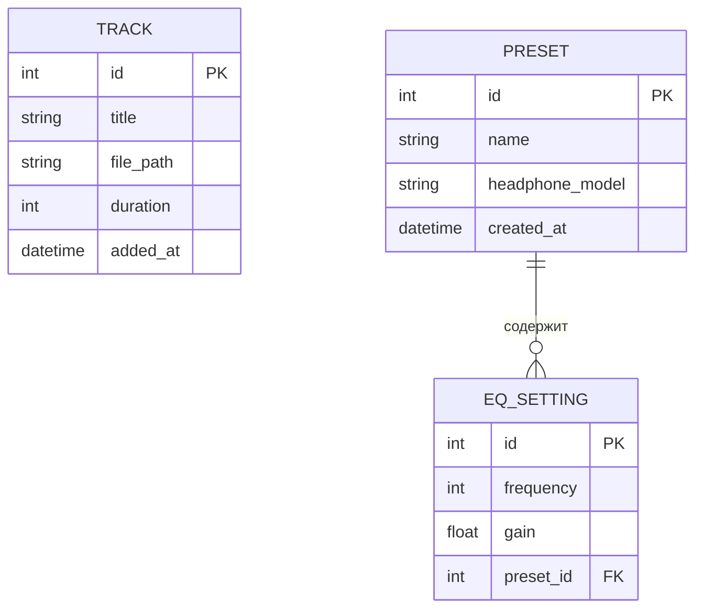
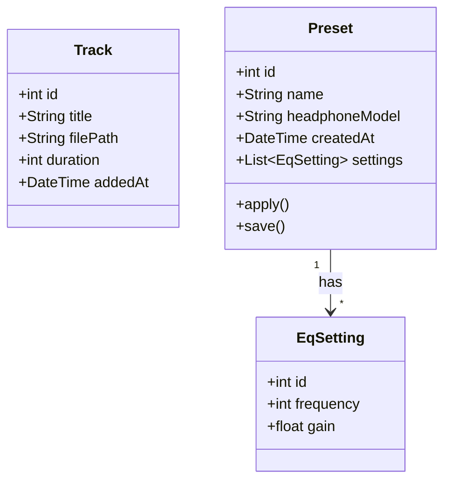

# Проектирование базы данных

# БД для EXTEND Audio

База данных EXTEND Audio хранит информацию о загруженных аудиофайлах и сохранённых пресетах эквалайзера. В первой версии данные хранятся локально на устройстве пользователя (Room/SQLite). БД состоит из трёх основных сущностей: треки, пресеты, настройки эквалайзера. Связи между сущностями позволяют привязывать несколько настроек эквалайзера к одному пресету.

## Присутствующие сущности

| Сущность | Зачем | Поля | Связи |
| --- | --- | --- | --- |
| Track | Хранит загруженные аудиофайлы | id, title, file_path, duration, added_at | — |
| Preset | Хранит сохранённые пресеты | id, name, headphone_model, created_at | 1:N к EqSetting |
| EqSetting | Хранит значения одного ползунка эквалайзера | id, frequency, gain, preset_id | N:1 к Preset |

## ERD-диаграмма

## UML-диаграмма моделей

## Словарь данных

| Таблица | Поле | Тип | Ключ | Обязательно | Описание |
| --- | --- | --- | --- | --- | --- |
| Track | id | INTEGER | PK | Да | Уникальный ID трека |
| Track | title | VARCHAR | — | Да | Название трека |
| Track | file_path | VARCHAR | — | Да | Путь к файлу на устройстве |
| Track | duration | INTEGER | — | Да | Длительность в секундах |
| Track | added_at | DATETIME | — | Да | Дата добавления |
| Preset | id | INTEGER | PK | Да | Уникальный ID пресета |
| Preset | name | VARCHAR | — | Да | Название пресета |
| Preset | headphone_model | VARCHAR | — | Нет | Модель наушников |
| Preset | created_at | DATETIME | — | Да | Дата создания |
| EqSetting | id | INTEGER | PK | Да | Уникальный ID настройки |
| EqSetting | frequency | INTEGER | — | Да | Частота ползунка (Гц) |
| EqSetting | gain | FLOAT | — | Да | Значение усиления (дБ) |
| EqSetting | preset_id | INTEGER | FK | Да | Ссылка на пресет |

## Нормализация

| Нормальная форма | Проверка | Результат |
| --- | --- | --- |
| **1НФ** | В ячейках хранится одно значение, нет списков | Поля atomic: frequency = одна частота, gain = одно значение |
| **2НФ** | Неключевые поля зависят от всего ключа | У каждого поля есть конкретная сущность, составных ключей нет |
| **3НФ** | Поля зависят от ключа, а не друг от друга | frequency и gain зависят от id настройки, а не от preset_id напрямую |

## CRUD-матрица

| Сущность | Create | Read | Update | Delete | Где используется |
| --- | --- | --- | --- | --- | --- |
| Track | Импорт трека | Библиотека треков | — | Удаление трека | Библиотека, Плеер |
| Preset | Сохранение пресета | Список пресетов | Редактирование названия/модели | Удаление пресета | Библиотека пресетов |
| EqSetting | Создание настроек при сохранении пресета | Применение к эквалайзеру | Изменение ползунков | Удаление вместе с пресетом | Эквалайзер |

## Работа с AI

При проектировании базы данных использовалася Mimo v2.5 для проверки связей и генерации черновой ERD. Итоговая структура была адаптирована под конкретный проект: добавлены обязательные поля, проверены типы данных, определены связи 1:N.

## Итоговый вывод по БД

База данных EXTEND Audio состоит из трёх сущностей: Track, Preset, EqSetting. Связь между пресетами и настройками эквалайзера — одна ко многим (1:N). Структура нормализована по 1НФ, 2НФ и 3НФ. В первой версии данные хранятся локально в Room/SQLite, серверная часть пока не будет интегрирована.