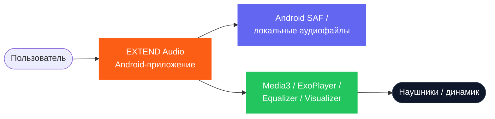
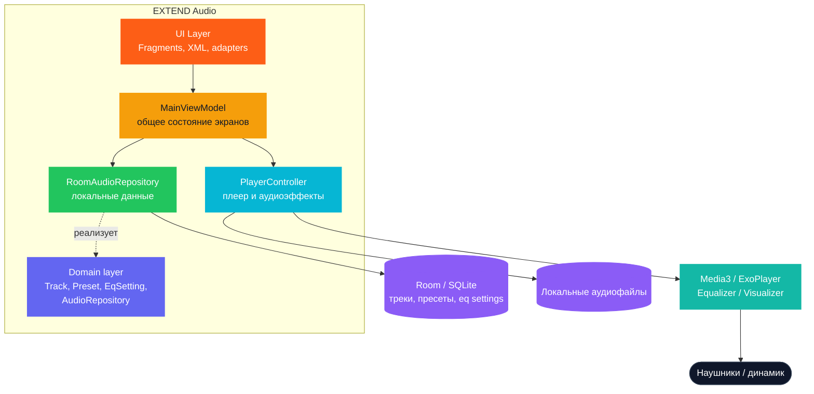

# Архитектура

# Архитектура EXTEND Audio

EXTEND Audio — локальное приложение без серверной части. Все данные хранятся на устройстве пользователя в базе данных Room/SQLite. Архитектура слоистая: UI → Presentation (ViewModel) → Domain (Repository) → Data (Room, файловая система). Основные модули: плеер, эквалайзер, библиотека треков, библиотека пресетов, профиль. Такая структура позволяет отделить интерфейс от логики и легко добавлять новые функции без изменения существующих модулей.

## Системный контекст

## Контейнерная схема

## Модули приложения

| Модуль | Ответственность | Вход | Выход |
| --- | --- | --- | --- |
| `ui/welcome` | Стартовый экран приложения, вход в основной сценарий MVP | Запуск приложения, нажатия пользователя | Переход в библиотеку, запуск импорта папки |
| `ui/library` | Отображение библиотеки треков, поиск, импорт папки | Список треков, поисковый запрос, действия пользователя | Открытие трека, переход в плеер, запрос на импорт |
| `ui/presets` | Просмотр сохранённых пресетов, применение, редактирование, удаление | Список пресетов, активный пресет, нажатия пользователя | Смена активного пресета, переход в Mixer для редактирования |
| `ui/mixer` | Создание и редактирование пресета, изменение полос эквалайзера | Активный/редактируемый пресет, значения ползунков | Обновлённый пресет, сохранение в БД, применение настроек |
| `ui/player` | Экран текущего трека и управление воспроизведением | Текущий трек, состояние плеера, визуализатор, действия пользователя | Play/Pause, seek, next/prev, repeat, shuffle |
| `ui/profile` | Отображение локальной статистики приложения | Данные о треках, пресетах и текущем состоянии | Экран профиля со статистикой |
| `ui/main` | Хранение общего UI-состояния приложения и координация экранов | Данные из Repository и PlayerController, действия из Fragment | `uiState` для всех основных экранов |
| `ui/common` | Общие UI-утилиты и переиспользуемая логика интерфейса | Метаданные трека, URI обложки, значения форматирования | Форматированный текст, загруженная обложка, общие UI-хелперы |
| `navigation` | Маршруты и переходы между экранами приложения | Текущий экран, пользовательское действие | Навигация на нужный Fragment |
| `domain/model` | Основные модели предметной области приложения | Данные из БД и локальных источников | Объекты `Track`, `Preset`, `EqSetting` |
| `domain/repository` | Контракт доступа к данным приложения | Запросы от `ViewModel` | Абстракция работы с треками и пресетами |
| `data/database` | Локальная база данных Room, DAO и сущности | Операции чтения/записи | Сохранённые треки, пресеты и настройки эквалайзера |
| `data/local` | Реализация репозитория поверх Room | Запросы от `ViewModel` и `domain/repository` | Потоки данных, сохранение и обновление локального состояния |
| `player` | Воспроизведение аудио, управление плеером, equalizer и visualizer | Текущий трек, активный пресет, команды управления | Звук, состояние воспроизведения, позиция трека, визуальные аудиоданные |
| `res` | XML-разметка, drawable-ресурсы, строки, цвета, меню и nav graph | Запросы интерфейса Android | Визуальные ресурсы и конфигурация экранов |

## Потоки данных

### Сценарий 1: Создание пресета

### Сценарий 2: Прослушивание трека с пресетом

## Структура проекта

EXTEND Audio
├── UI Layer
│   ├── WelcomeFragment
│   ├── LibraryFragment
│   ├── PresetsFragment
│   ├── MixerFragment
│   ├── PlayerFragment
│   └── ProfileFragment
├── Presentation Layer
│   └── MainViewModel
├── Data Layer
│   ├── AudioRepository
│   ├── RoomAudioRepository
│   ├── Room Database
│   └── Local audio/file access
└── Player Layer
└── PlayerController
├── Media3 / ExoPlayer
├── Android Equalizer
└── Android Visualizer

## Раздел «ADR»

### ADR-01: Локальное хранение данных и офлайн-MVP

| Поле | Описание |
| --- | --- |
| Контекст | MVP приложения EXTEND Audio должен работать без собственной серверной части и без обязательного подключения к интернету. Нужно хранить метаданные треков, пользовательские пресеты и настройки эквалайзера локально на устройстве. |
| Решение | Использовать `Room / SQLite` для хранения треков, пресетов и настроек эквалайзера. Сами аудиофайлы не копируются в БД, а читаются из памяти устройства через Android SAF / локальные URI. |
| Альтернативы | `JSON-файлы`, `SharedPreferences`, серверная БД / backend, Firebase, Realm |
| Причина | `Room` является стандартным и хорошо поддерживаемым решением для Android, позволяет удобно работать с таблицами, DAO и связями между сущностями. Такой подход подходит для учебного MVP и не требует серверной инфраструктуры. |
| Последствия | Приложение может работать локально и без интернета, но данные привязаны к одному устройству. Облачная синхронизация и совместный доступ остаются за пределами MVP. |

### ADR-02: Single-Activity + Fragments + Navigation Component

| Поле | Описание |
| --- | --- |
| Контекст | Приложение включает несколько основных экранов: Welcome, Library, Presets, Mixer, Player и Profile. Нужно организовать понятную навигацию и при этом не разносить логику по множеству Activity. |
| Решение | Использовать архитектурный подход `Single-Activity`, где `MainActivity` выступает контейнером, а основные разделы реализованы через `Fragments` и `Navigation Component`. |
| Альтернативы | Несколько `Activity`, ручная навигация без Navigation Component, Jetpack Compose Navigation |
| Причина | Такой подход соответствует структуре MVP, упрощает маршрутизацию между экранами, хорошо сочетается с нижней навигацией и облегчает управление общим состоянием приложения. |
| Последствия | Навигация становится централизованной и предсказуемой, но возрастает зависимость от единой Activity и nav graph. При расширении проекта потребуется аккуратно поддерживать связи между Fragment-экранами. |

### ADR-03: Централизация аудиологики в PlayerController

| Поле | Описание |
| --- | --- |
| Контекст | EXTEND Audio должен воспроизводить локальные треки, управлять состоянием плеера, применять активный пресет и поддерживать аудио-визуальные эффекты. Эти функции нельзя безопасно размазывать по Fragment-экранам. |
| Решение | Выделить `PlayerController` как единый модуль управления аудио: воспроизведение через `Media3 / ExoPlayer`, применение настроек через системный `Equalizer`, а визуализацию через `Visualizer`. |
| Альтернативы | Логика воспроизведения прямо во `Fragment`, отдельный `EqualizerEngine`, использование `MediaPlayer` вместо `ExoPlayer` |
| Причина | Централизация воспроизведения и аудиоэффектов упрощает поддержку состояния плеера, позволяет переиспользовать одну аудиосессию и уменьшает дублирование логики между Library, Player и Mixer. |
| Последствия | Управление звуком сосредоточено в одном месте, что упрощает архитектуру MVP. Однако требуется отдельно учитывать ограничения системного `Equalizer` на разных устройствах и возможные различия в поддержке аудиоэффектов. |

### ADR-04: Общая MainViewModel для синхронизации состояния экранов

| Поле | Описание |
| --- | --- |
| Контекст | В приложении EXTEND Audio несколько экранов используют общее состояние: текущий трек, активный пресет, список треков, список пресетов, состояние воспроизведения и настройки плеера. Эти данные должны быть согласованы между Library, Player, Mixer, Presets и Profile. |
| Решение | Использовать общую `MainViewModel` на уровне Activity, которая объединяет данные из `RoomAudioRepository` и `PlayerController` и предоставляет единое `uiState` для основных экранов приложения. |
| Альтернативы | Отдельная `ViewModel` для каждого экрана без общего состояния, передача данных через `Bundle` и аргументы навигации, хранение части состояния прямо во `Fragment` |
| Причина | Общая `MainViewModel` упрощает синхронизацию экранов, позволяет сразу отражать изменения активного трека и пресета в разных разделах приложения и уменьшает дублирование логики. |
| Последствия | Состояние приложения становится централизованным и удобным для управления, но сама `MainViewModel` становится более крупной и требует аккуратного разделения ответственности при дальнейшем развитии проекта. |

## Итоговый вывод по архитектуре

Архитектура EXTEND Audio представляет собой локальное Android-приложение без собственной серверной части, ориентированное на реализацию MVP-сценария офлайн-прослушивания музыки и работы с пользовательскими пресетами. Метаданные треков, пресеты и настройки эквалайзера сохраняются в `Room / SQLite`, а сами аудиофайлы читаются из памяти устройства через системные Android-механизмы доступа к файлам. Внутренняя структура проекта построена по слоистому принципу: `UI (Fragments + XML)` отвечает за экраны и взаимодействие с пользователем, `MainViewModel` — за общее состояние приложения, `RoomAudioRepository` — за локальные данные, а `PlayerController` — за воспроизведение аудио и применение аудиоэффектов. Принятые ADR фиксируют ключевые архитектурные решения: локальное хранение данных, использование `Single-Activity + Fragments + Navigation Component`, централизацию аудиологики в `PlayerController` и использование общей `MainViewModel` для синхронизации экранов. Такая архитектура соответствует текущему объёму MVP, остаётся понятной для защиты и создаёт основу для дальнейшего развития приложения.