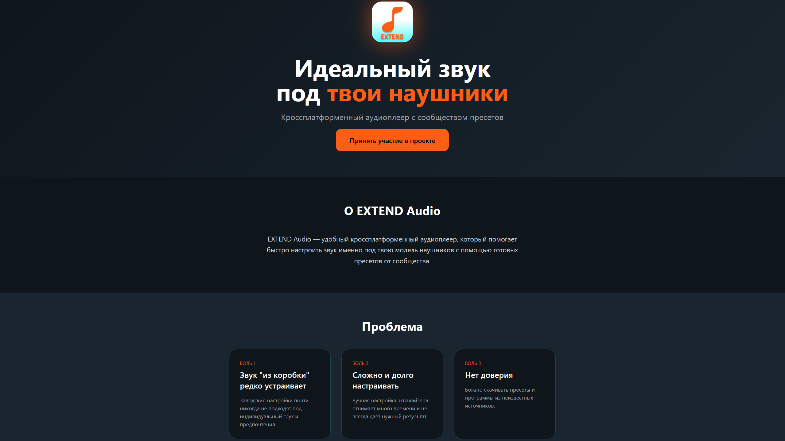
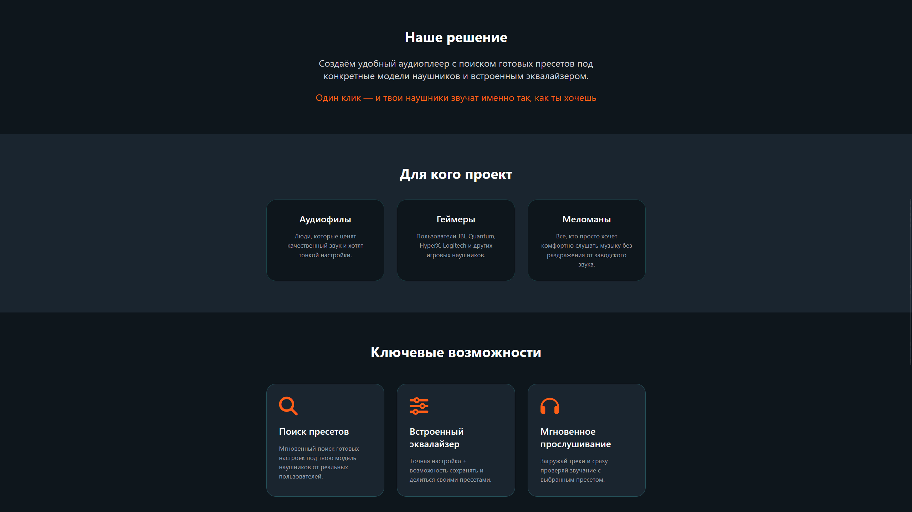
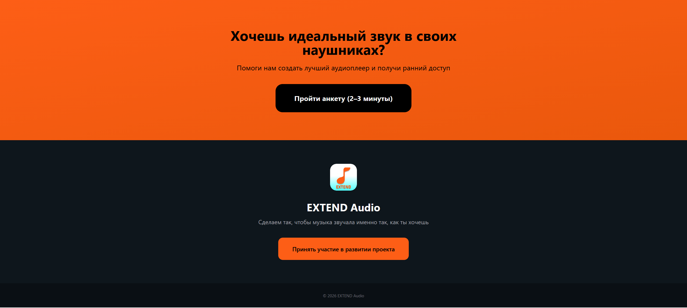

# Landing page

Ссылка на страницу:

На первом скриншоте лендинга проекта присутствуют: Лого и название проекта его краткое описание и проблемы которые мой проект должен исправить

На втором скриншоте располагаются следующие элементы: Решение найденых проблем программой, кратко описана целевая для кого проект и описан основной функционал 

На последнем конец страницы и кнопка-ссылка для перехода на прохождение анкеты.

Лендинг полностью был создан с помощью GROK с парой моих доработок. Я ему объяснил всю свою идею, необходимую структуру и то какую цветовую гамму хочу увидеть и вот что вышло.

Сайт находится в сети только пока запущен мой сервер. Хост через стандартную службу windows IIS, да очень просто за то за мной полный контроль над всем этим.